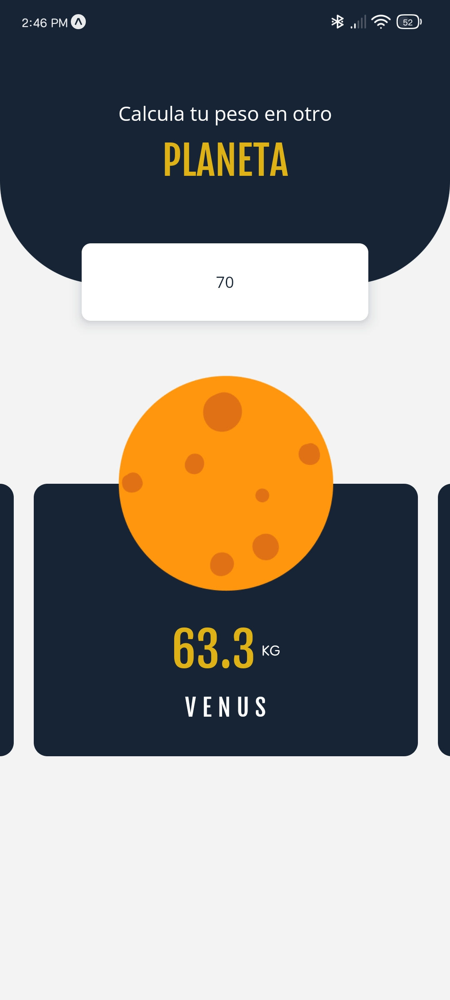

# Peso Planeta



## Proyecto con React Native

&nbsp;
&nbsp;

### 📱 App

✔️ Ingresa tu peso y aprende como seria este en otros planetas de acuerdo a su gravedad.

&nbsp;
&nbsp;

### Dependencias

-   [expo font](https://docs.expo.dev/versions/latest/sdk/font/)
-   [expo splash-screen](https://docs.expo.dev/versions/latest/sdk/splash-screen/)
-   [react-native-svg](https://docs.expo.dev/versions/latest/sdk/svg/)
-   [react-native-reanimated](https://docs.swmansion.com/react-native-reanimated/)

&nbsp;
&nbsp;

### Iniciar desarrollo

```
yarn start
```
